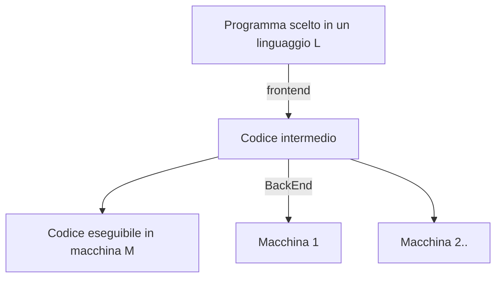

# Linguaggi Formali e Compilatori

[TOC]

## 18/09/2019

### Cosa si fa

1. Tecniche e algoritmi per sviluppare compilatori;
2. Capire linguaggi formali;
3. Riconoscere l'appartenenza di una stringa ad un linguaggio formale;

Allo scrivere di un programma, utilizziamo una sintassi.

Specifica la grammatica di un linguaggio: Il ruolo delle espressioni/identificatori in un linguaggio di programmazione.

Si vedrà:

1. Linguaggi regolari(simil Regex)
2. Automi a stati finiti
3. Analisi sintattica e analisi Semantica.


Un compilatore generalmente effettua:




> Il tutto è strettamente **hardware dependent**.

Per convenienza verranno mostrate in Pipeline (le fasi), ma generalmente un compilatore esegue delle funzioni anche in parallelo e non solo in cascata.


Al massimo livello di granularità:

* **Analisi Lessicale**(Parsing del linguaggio)

  * Quali componenti sono parole chiave?
  * Quali componenti sono identificatori?
  * Quali componenti sono espressioni?

* **Analisi Sintattica** (Analisi semantica e codice intermedio)

  * Sintatticamente, cosa vuol dire ?
  * Sintax driven definition

* **Enviroment a Runtime**

  * Come alloco in memoria le strutture generate in queste fasi?	


  Esempio: 

  Posso scrivere `pippo=2+4` in `c`?

  ```pseudocode
  pippo=2+4
  
  <identificatore> simbolo_di_assegnamento (numero,2) simbolo_di_addizione (numero,4)
  ```

  Ora controllo se posso scrivere `<identificatore> simbolo_di_assegnamento (numero,2) simbolo_di_addizione (numero,4)` sulla grammatica del `c`. Se posso, **proseguo**, altrimenti (come compilatore) mi lamento.


### Esame

Leggi slide.

1 domanda è sul syllabus (sì, veramente).

Primo appello si può fare l'orale(**PRIMO APPELLO**).


### Grammatica

> **Grammatica Formale**: struttura astratta che descrive un linguaggio formale in modo preciso, è cioè un sistema di regole che delineano matematicamente un insieme di sequenze finite di simboli appartenenti ad un alfabeto anch'esso finito.	

```yacas
relational_expression
	: shift_expression
	| relational_expression '<' shift_expression
	| relational_expression '>' shift_expression
	| relational_expression LE_OP shift_expression
	| relational_expression GE_OP shift_expression
```

Queste regole ci dicono come creare una equazione relazionale complessa.

Semplificando:

```pseudocode
relational_exp==>shift_exp
			|relational_exp<shift_exp
			|relational_exp>shift_exp
			|relational_exp<= shift_exp
			|true
```

`relational_exp` può essere una `shift_exp` oppure una `relational_exp<shift_exp` oppure `[...]` oppure `true`.

Va in sostituzione così:

```pseudocode
relational_exp==>relational_exp<=shift_exp
		       ==>relational_exp>shift_exp<=shift_exp
		       ==>true> shift_exp<=shift_exp
```


