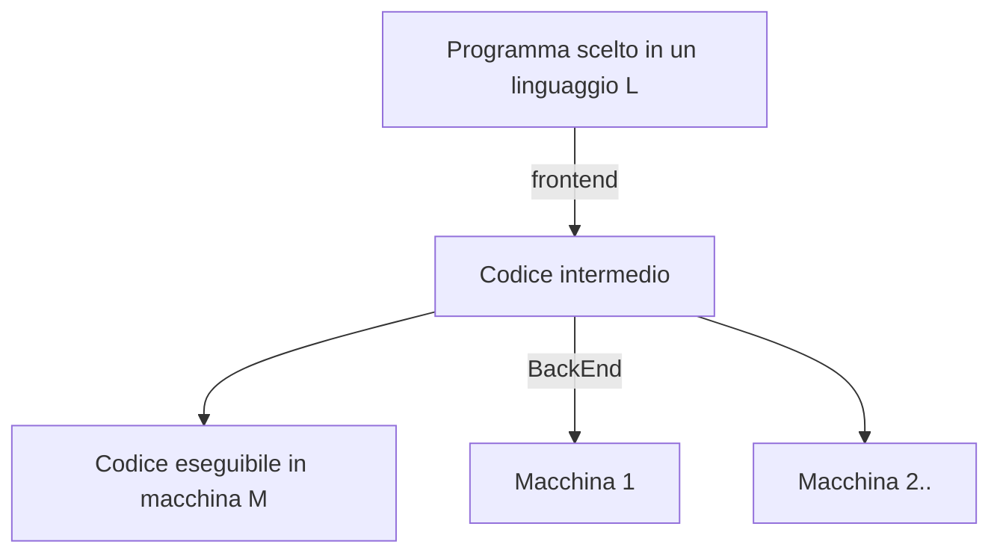
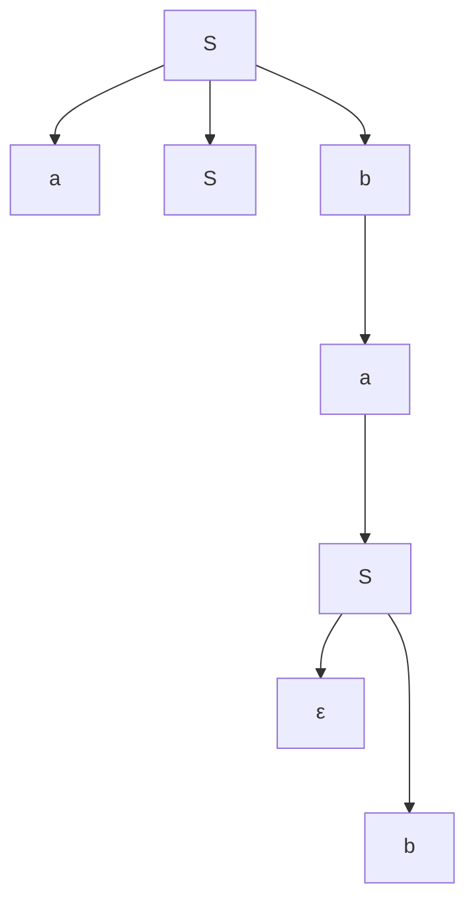
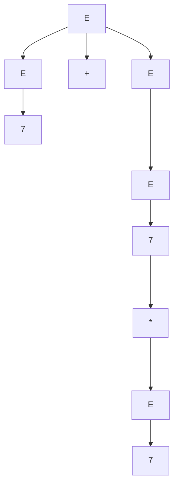

# Linguaggi Formali e Compilatori

[TOC]

## 18/09/2019

### Cosa si fa

1. Tecniche e algoritmi per sviluppare compilatori;
2. Capire linguaggi formali;
3. Riconoscere l'appartenenza di una stringa ad un linguaggio formale;

Allo scrivere di un programma, utilizziamo una sintassi.

Specifica la grammatica di un linguaggio: Il ruolo delle espressioni/identificatori in un linguaggio di programmazione.

Si vedrà:

1. Linguaggi regolari(simil Regex)
2. Automi a stati finiti
3. Analisi sintattica e analisi Semantica.


Un compilatore generalmente effettua:




> Il tutto è strettamente **hardware dependent**.

Per convenienza verranno mostrate in Pipeline (le fasi), ma generalmente un compilatore esegue delle funzioni anche in parallelo e non solo in cascata.


Al massimo livello di granularità:

* **Analisi Lessicale**(Parsing del linguaggio)

  * Quali componenti sono parole chiave?
  * Quali componenti sono identificatori?
  * Quali componenti sono espressioni?

* **Analisi Sintattica** (Analisi semantica e codice intermedio)

  * Sintatticamente, cosa vuol dire ?
  * Sintax driven definition

* **Enviroment a Runtime**

  * Come alloco in memoria le strutture generate in queste fasi?	


  Esempio: 

  Posso scrivere `pippo=2+4` in `c`?

  ```pseudocode
  pippo=2+4
  
  <identificatore> simbolo_di_assegnamento (numero,2) simbolo_di_addizione (numero,4)
  ```

  Ora controllo se posso scrivere `<identificatore> simbolo_di_assegnamento (numero,2) simbolo_di_addizione (numero,4)` sulla grammatica del `c`. Se posso, **proseguo**, altrimenti (come compilatore) mi lamento.


### Esame

Leggi slide.

1 domanda è sul syllabus (sì, veramente).

Primo appello si può fare l'orale(**PRIMO APPELLO**).


### Grammatica

> **Grammatica Formale**: struttura astratta che descrive un linguaggio formale in modo preciso, è cioè un sistema di regole che delineano matematicamente un insieme di sequenze finite di simboli appartenenti ad un alfabeto anch'esso finito.	

```yacas
relational_expression
	: shift_expression
	| relational_expression '<' shift_expression
	| relational_expression '>' shift_expression
	| relational_expression LE_OP shift_expression
	| relational_expression GE_OP shift_expression
```

Queste regole ci dicono come creare una equazione relazionale complessa.

Semplificando:

```pseudocode
relational_exp==>shift_exp
			|relational_exp<shift_exp
			|relational_exp>shift_exp
			|relational_exp<= shift_exp
			|true
```

`relational_exp` può essere una `shift_exp` oppure una `relational_exp<shift_exp` oppure `[...]` oppure `true`.

Va in sostituzione così:

```pseudocode
relational_exp==>relational_exp<=shift_exp
		       ==>relational_exp>shift_exp<=shift_exp
		       ==>true> shift_exp<=shift_exp
```


## 18/09/2019


$T$ insieme di simboli terminali, le grammatiche consentono di descrivere i linguaggi tramite **produzioni** 

$P$ è l'insieme di produzioni

Esempio di produzione: $stringa_1\rightarrow stringa_2$

La sostituzione di "$stringa_1$" con "$stringa_2$" nella parola $p$ è un *passo di derivazione* rispetto alla produzione (I passi di derivazione usano $\Rightarrow$)

Nomi nelle produzioni: $<driver>\ \rightarrow\  <body>$, di solito nel driver abbiamo dei simboli non terminali.

$V$ è un vocabolario ovvero un insieme dei simboli terminali e dei simboli non terminali

$S\in V\setminus T$ che è lo start symbol 

$G=(V,T,P,S)$

regole generali:

* lettere minuscole per elementi di $T$
* lettere maiuscole per leementi di $V\setminus T$
* $\alpha,\beta,\gamma,…$ stringhe su simboli in $V$
* $w,w',…$ stringhe su simboli in $T$
* $\varepsilon$ parola vuota

Il linguaggio che è definito da una certa grammatica $L(G)$ è l'insieme delle parole in $T^*\or\{\varepsilon\}$ che possono essere derivate in uno o più passi da $S$

$$L(G)=\{w|S\Rightarrow^+w\ \and w\in T^*\or\{\varepsilon\}\}$$

NB: [^simbolo+]: Una o più ripetizioni di "simbolo" [^simbolo*]: Zero o più ripetizioni di "simbolo"

Esempio

 $G_1:\\ ^{(1)}S\rightarrow aAb\\^{(2)}aA\rightarrow aaAb\\^{(3)}A\rightarrow\varepsilon$

$S\Rightarrow \underbrace{aA}B\Rightarrow a\underbrace{aA}bb\Rightarrow aaa\underbrace{A}bbb\Rightarrow aaabbb$ quindi $L(G_1)=\{a^nb^n|n>0\}$

$G_2\\^{(1)}S\rightarrow aA\\^{(2)}A\rightarrow A\\^{(3)}B\rightarrow Bb \\^{(4)}B\rightarrow B$

soluz: $L(G_2)=\{a^nb^n|n>0\}$

$G_3\\^{(1)}S\rightarrow aSBc\\^{(2)}S\rightarrow abc\\^{(3)}cB\rightarrow Bc \\^{(4)}bB\rightarrow bb$

Soluz: $L(G_3)=\{a^nb^nc^n|n>0\}$

$G_4\\^{(1)}S\rightarrow Aa\\^{(2)}A\rightarrow S\\L(G_4)=\empty$

$G_5\\^{(1)}S\rightarrow \varepsilon\ \\L(G_5)=\{\varepsilon\}$

$G_6\\^{(1)}S\rightarrow aSb\\^{(2)}S\rightarrow \varepsilon\ \\L(G_6)=\{a^nb^n|n>0\}$

Albero di derivazione



La grammatiga $G_3$ è *dipendente da contesto*, perchè ha almeno una produzione il cui driver non è dato unicamente dal un non terminale.

**DEF:** Una grammatica $G=(V,T,P,S)$ è *libera da contesto* se tutte le sue produzioni sono introdotte da $A\rightarrow \alpha$.

**DEF:** Un linguaggio $L$ è *libero da contesto* se esiste una grammatica libera $G$ tale che $L=L(G)$


## 20/09/2019

[Recap di lezione precedente]

 Per le grammatiche libere da contesto negli alberi di derivazione si parla di derivazioni **right-most** e **left-most**

Ad esempio $E\rightarrow E+E \mid E*E \mid 7 $ vogliamo derivare $7+7*7$ con la right-most $E\Rightarrow E+E\Rightarrow E+E*E\Rightarrow E+E+7\Rightarrow E+7*7\Rightarrow 7+7*7$



Una grammatica $G$ è **ambigua** se esiste $w\leftarrow L(G)$ che può essere derivato con $2$ derivazioni distinte, entrambe right-most o entrambe left-most.

```pseudocode
S	->if B then S else S |
		if B then S |
		altro
		
B ->true | false

T={if, then, else, altro, true, false}
```

Dimostrare che questa grammatica è ambigua

> `if true then if false then altro else altro`, in questo caso di quale if è l'else? Boh, è ambigua!

$s\Rightarrow if\ true\ then\ S\ else \underbrace S\\\Rightarrow if\ true\ then\ \underbrace S\ else\ altro\\\Rightarrow if\ true\ then\ if\ false\ then\ \underbrace S\ else\ altro\\\Rightarrow if\ true\ then\ if\ false\ then\ altro\ else\ altro $

Conosciuto come il problema del **dangling else**

**LEMMA:** I linguaggi liberi sono chiusi rispetto all'unione.

**Dimostrazione** Siano $L_1$ e $L_2$ due linguaggi liberi. Allora esistono due grammatiche libere $G_1$ e $G_2$ tali che $L_1=L(G_1)$ e $L_2=L(G_2)$.
Sia $G_1=(V_1,T_1,P_1,S_1)$ e $G_2=(v_2,T_2,P_2,S_2)$.
Rinominono i non terminali di $G_1$ e $G_2$ in modo da non avere clash di nomi. Chiamiamo $V'_1$ e $V'_2$ i vocabolari ottenuti per direnomizaione di $V_1$ e di $V_2$ e scelgo un nuvo non terminale, diciamo $Z$.
Definiamo $G=(V'_1∪V'_2∪\{Z\},T_1∪T_2,P'_1∪P'_2∪\{Z\rightarrow S'_1\mid S'_2\},Z)$

**LEMMA:** I linguaggi liberi sono chiusi rispetto alla concatenazione

